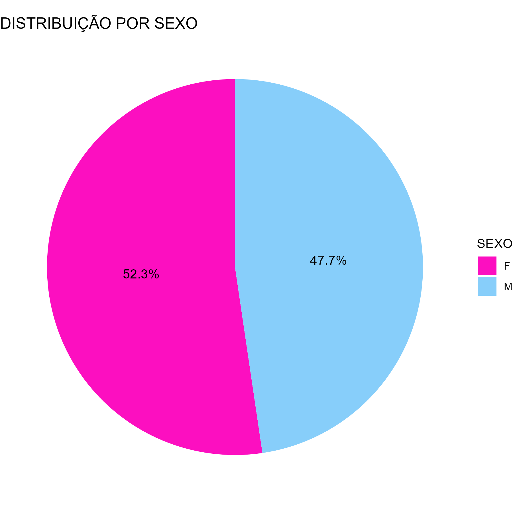
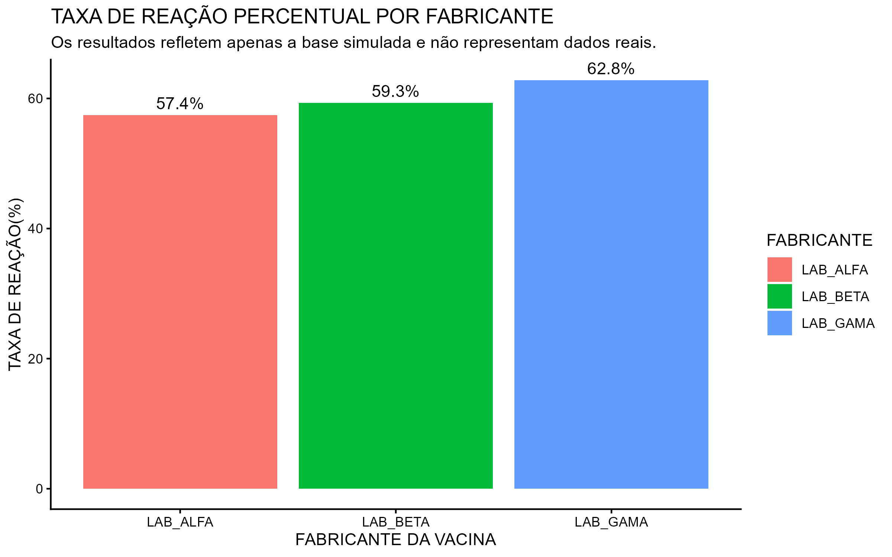

# 💉 Análise de Dados em Farmacovigilância (ESAVI)

## 📌 Sobre o Projeto

Este projeto foi desenvolvido como atividade prática de estudo em Análise de Dados aplicada à Saúde, com foco em Farmacovigilância.

A proposta foi trabalhar com uma base de dados simulada de **Eventos Supostamente Atribuíveis à Vacinação ou Imunização (ESAVI)**, semelhante às utilizadas em sistemas de vigilância em saúde pública.

O objetivo principal foi limpar, organizar e analisar dados brutos, transformando informações desestruturadas em resultados que auxiliem a compreensão de possíveis reações adversas associadas a vacinas.

> **Importante:** Os dados utilizados são 100% fictícios, gerados apenas para fins educacionais e prática em análise de dados.

---

## 🛠️ Ferramentas Utilizadas
* **Linguagem:** R
* **Pacotes:** `tidyverse` (dplyr, tidyr, stringr, ggplot2)
* **Ambiente:** RStudio

---

## ⚙️ Problemas Trabalhados
A base de dados simulada apresentava situações comuns em dados reais da área da saúde:
* **Dados Mistos:** Nome, sexo e idade do paciente em uma única coluna (exemplo: `"Ana | F | 30 anos"`).
* **Inconsistência:** Diferentes grafias para o mesmo fabricante de vacina.
* **Texto Livre:** Relatos clínicos sem padronização.

---

## 🔍 Estratégia Utilizada
Para resolver esses problemas, foram realizadas as seguintes etapas:
1. Separação e limpeza dos dados demográficos.
2. Padronização dos fabricantes por regras simples de texto (Regex).
3. Identificação automática de possíveis reações adversas com base em palavras-chave (Dor, febre, mialgia, fadiga, vermelhidão).
4. Organização dos dados para análise estatística.

---

## 📊 Resultados Obtidos

### 1. Perfil Demográfico (Caracterização da Amostra)
Para garantir que os dados não apresentam viés populacional, foi analisada a distribuição por sexo dos pacientes vacinados.

---

### 2. Análise de Segurança (Farmacovigilância)
Abaixo, apresentamos a taxa de notificação de eventos adversos (reações) por fabricante de vacina.

| Fabricante | Taxa de Reação (%) |
| :--- | :--- |
| **LAB_GAMA** | **62,8%** |
| LAB_BETA | 59,3% |
| LAB_ALFA | 57,4% |

*Nota: Os resultados refletem apenas a base simulada e não representam dados reais.*
---

## ✅ Funcionalidades Implementadas (Roadmap)
* [x] **Análise Demográfica:** Exploração da distribuição dos pacientes por sexo (Gráfico de Pizza).
* [x] **Visualização de Indicadores:** Criação de gráfico de barras comparativo (Taxa de Reação por Fabricante).

---

## 💻 Como Executar
1. Clone este repositório.
2. Execute o script `01_geracao_dados.R` para gerar a base simulada.
3. Execute o script `02_analise_esavi.R` para realizar a análise.
4. Execute o script `03_visualizacao.R` para gerar os gráficos e salvar as imagens.

---

**Desenvolvido por Inácio Vieira** *Estudante de Enfermagem na Universidade Federal de Minas Gerais (UFMG) | Iniciando em Análise de Dados em Saúde* [LinkedIn](https://www.linkedin.com/in/inaciosantosvieira/)

